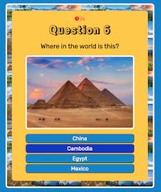

# Where in the World?

**Play the game at:** https://jengori.github.io/where-in-the-world

This is a project completed as part of the Code First Girls](https://codefirstgirls.com) **JavaScript Kickstarter** course.

**Where in the World?** is a quiz app written in vanilla JavaScript, CSS and HTML.

The player is presented with a series of 10 questions each consisting of an image of a world landmark, with the player being required to guess which country the landmark is in from four possible answers.

Features of the quiz:
- a timer which allows 10 seconds for the player to answer each question
- sound effects which vary depending on whether the question is answered correctly or incorrectly
- a final page which displays the player's score out of 10, with a round of applause sound effect if all 10 questions were answered correctly

## Screenshots

## Links

- Repository URL: https://github.com/jengori/where-in-the-world
- Live Site URL: https://jengori.github.io/where-in-the-world
